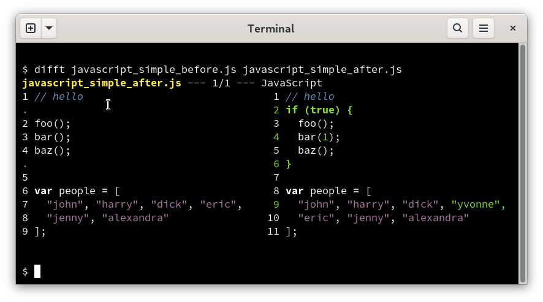

  
   
  
  
  
  

Difftastic is a structural diff tool that compares files based on
their syntax.

**For installation instructions, see
[Installation](https://difftastic.wilfred.me.uk/installation.html) in
[the manual](http://difftastic.wilfred.me.uk/).**

## Basic Example

In this JavaScript example, we can see:

(1) Difftastic understands nesting. It highlights the matching `{` and
`}`, but understands that `foo()` hasn't changed despite the leading
whitespace.

(2) Difftastic understands which lines should be aligned. It's aligned
`bar()` on the left with `bar(1)` on the right, despite their changes.

(3) Difftastic understands that line-wrapping isn't
meaningful. `"eric"` is now on a new line, but it hasn't changed.

## One Minute Demo

This one minute screencast demonstrates difftastic usage with both
standalone files and git.

## Languages

Difftastic supports over 30 programming languages, see [the
manual](https://difftastic.wilfred.me.uk/) for the full list.

If a file has an unrecognised extension, difftastic uses a
textual diff with word highlighting.

## Known Issues

Performance. Difftastic scales relatively poorly on files with a large
number of changes, and can use a lot of memory.

Display. Difftastic has a side-by-side display which usually works well, but can
be confusing.

Robustness. Difftastic regularly has releases that fix crashes.

## Non-goals

Patching. Difftastic output is intended for human consumption, and it
does not generate patches that you can apply later. Use `diff` if you
need a patch.

(Patch files are also line-oriented, which is too limited for
difftastic. Difftastic might find additions and removals on the same
line, and it tracks the relationship between line numbers in the old
and new file.)

Merging. AST merging is a hard problem that difftastic does not
address.

## FAQ

### Isn't this basically `--word-diff --ignore-all-space`?

Word diffing [can't do
this](https://twitter.com/_wilfredh/status/1510139929971421191/photo/1).

Difftastic parses your code. It understands when whitespace matters,
such as inside string literals or languages like Python. It understands
that `x-1` is three tokens in JS but one token in Lisp.

### Can I use difftastic with git?

You can! The difftastic manual [includes instructions for git
usage](https://difftastic.wilfred.me.uk/git.html). You can also use it
[with mercurial](https://difftastic.wilfred.me.uk/mercurial.html).

If you're a magit user, check out [this blog
post](https://tsdh.org/posts/2022-08-01-difftastic-diffing-with-magit.html)
showing one way to use difftastic with magit.

### Does difftastic integrate with my favourite tool?

Probably not. Difftastic is young. Consider writing a plugin for your
favourite tool, and I will link it in the README!

## Translation

+ [Chinese](./translation/zh-CN/README-zh-CN.md)

## License

Difftastic is open source under the MIT license, see LICENSE for more
details.

This repository also includes tree-sitter parsers by other authors in
the `vendored_parsers/` directory. These are a mix of the MIT license and the
Apache license. See `vendored_parsers/*/LICENSE` for more details.

Files in `sample_files/` are also under the MIT license unless stated
otherwise in their header.
