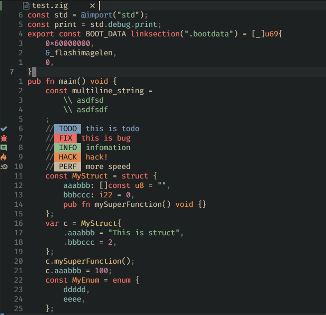

  <h1>Tree Sitter For Zig</h1>

  

    <a href="https://github.com/maxxnino/tree-sitter-zig">Zig's Tree Sitter</a>
    based on
    <a href="https://github.com/neovim/neovim/">Zig Spec</a> Official.
  

The goal of `Zig's Tree Sitter` is to support the latest [Zig](https://ziglang.org/) with good syntax highlighting and more functionality.

