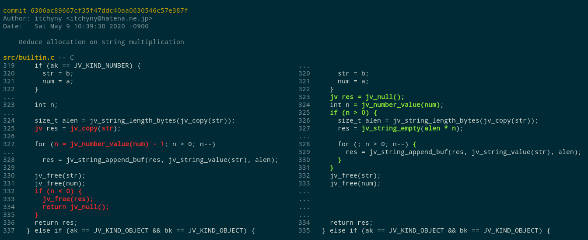
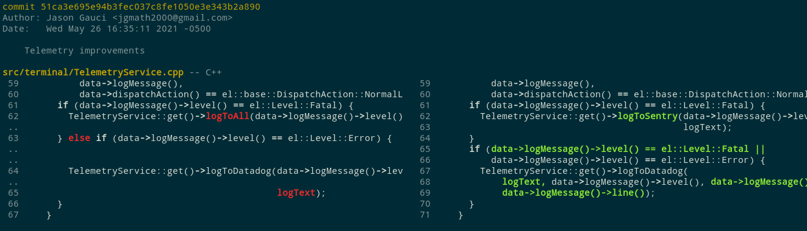
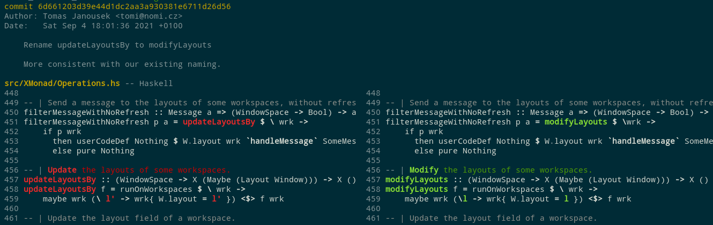

  
   
  
  
  

Difftastic is an experimental structured diff tool that compares files
based on their syntax.

See [the manual](http://difftastic.wilfred.me.uk/) to get started.

## Screenshots

## Languages

Difftastic supports the following languages:

* C
* C++
* C#
* Clojure
* CSS
* Elixir
* Emacs Lisp
* Go
* Haskell
* Java
* JavaScript (and JSX)
* JSON
* OCaml
* Python
* Rust
* TypeScript (and TSX)

If a file has an unrecognised extension, difftastic uses a
line-oriented diff.

## Known Issues

Performance. Difftastic scales relatively poorly on files with a large
number of changes, and can use a lot of memory. This might be solved
by A* search.

Display. Difftastic has a side-by-side which usually works well, but can
be confusing.

Diff accuracy. Some delimiter moves are currently ignored (see
[#30](https://github.com/Wilfred/difftastic/issues/30)).

Integration. Difftastic only has [limited
support](http://difftastic.wilfred.me.uk/getting_started.html#git-external-diffs)
for git and mercurial today.

## Non-goals

Patch files. If you want to create a patch that you can later apply,
use `diff`. Difftastic ignores whitespace, so its output is
lossy. (AST patching is also a hard problem.)

## License

Difftastic is open source under the MIT license, see LICENSE for more
details.

Files in `sample_files/` are also under the MIT license unless stated
otherwise in their header.

## Further Reading

The [wiki](https://github.com/Wilfred/difftastic/wiki) includes
additional notes on alternative diffing techniques and tools.
