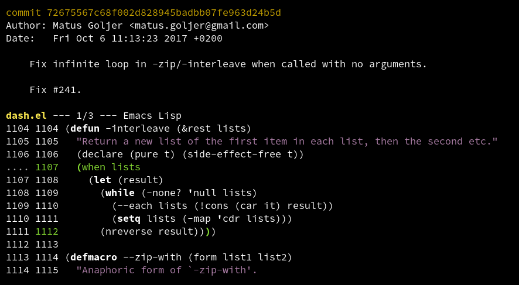
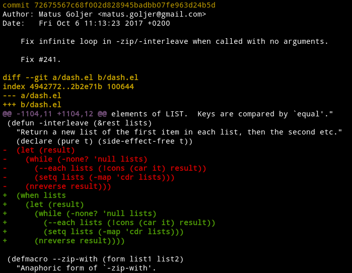
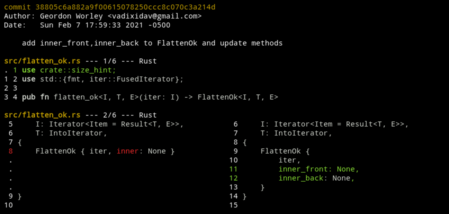
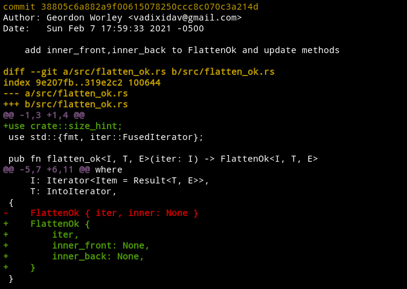

  
   
  
  
  

Difftastic is an experimental structured diff tool that compares files
based on their syntax.

See [the manual](http://difftastic.wilfred.me.uk/) to get started.

## Demo: Wrapping Expressions

Difftastic understands expression nesting. If you wrap an expression
in an if statement, difftastic understand that the inner values are
unchanged.

Compare this with git's default diff. It is confused by indentation
changes, and doesn't know which closing parenthesis has been added.

## Demo: Reflowing Code

Difftastic is robust to code formatting changes. If you change how
many items appear on a single line, difftastic will only show you
items which have changed.

In git's default diff, it's harder to see that `iter` and the curly
braces are unchanged. It's also harder to see the affected line numbers.

<!--
To regenerate these screenshots:

$ git clone git@github.com:magnars/dash.el.git
$ cd dash.el
$ GIT_EXTERNAL_DIFF=difft git show --ext-diff 72675567c68f002d828945badbb07fe963d24b5d

$ git clone git@github.com:rust-itertools/itertools.git
$ cd itertools
$ GIT_EXTERNAL_DIFF=difft git show --ext-diff 38805c6a882a9f00615078250ccc8c070c3a214d

-->

## Languages

Difftastic supports the following languages:

* Bash
* C
* C++
* C#
* Clojure
* CSS
* Elixir
* Emacs Lisp
* Go
* Haskell
* Java
* JavaScript (and JSX)
* JSON
* OCaml
* Python
* Ruby
* Rust
* TypeScript (and TSX)

If a file has an unrecognised extension, difftastic uses a
line-oriented diff.

## Known Issues

Performance. Difftastic scales relatively poorly on files with a large
number of changes, and can use a lot of memory. This might be solved
by A* search.

Display. Difftastic has a side-by-side display which usually works well, but can
be confusing.

Diff accuracy. Some delimiter moves are currently ignored (see
[#30](https://github.com/Wilfred/difftastic/issues/30)).

Integration. Difftastic only has [limited
support](http://difftastic.wilfred.me.uk/getting_started.html#git-external-diffs)
for git and mercurial today.

## Non-goals

Patch files. If you want to create a patch that you can later apply,
use `diff`. Difftastic ignores whitespace, so its output is
lossy. (AST patching is also a hard problem.)

## License

Difftastic is open source under the MIT license, see LICENSE for more
details.

Files in `sample_files/` are also under the MIT license unless stated
otherwise in their header.
