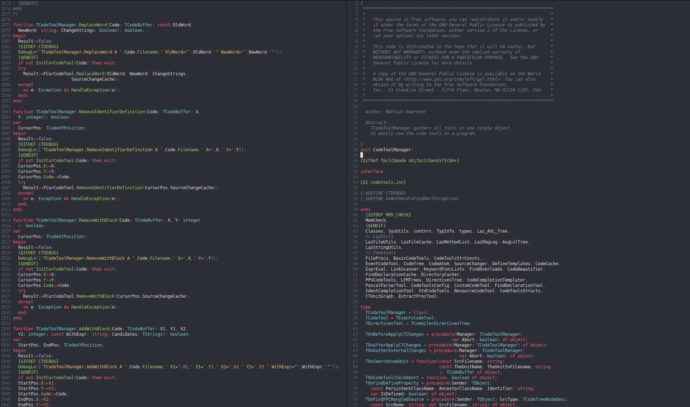
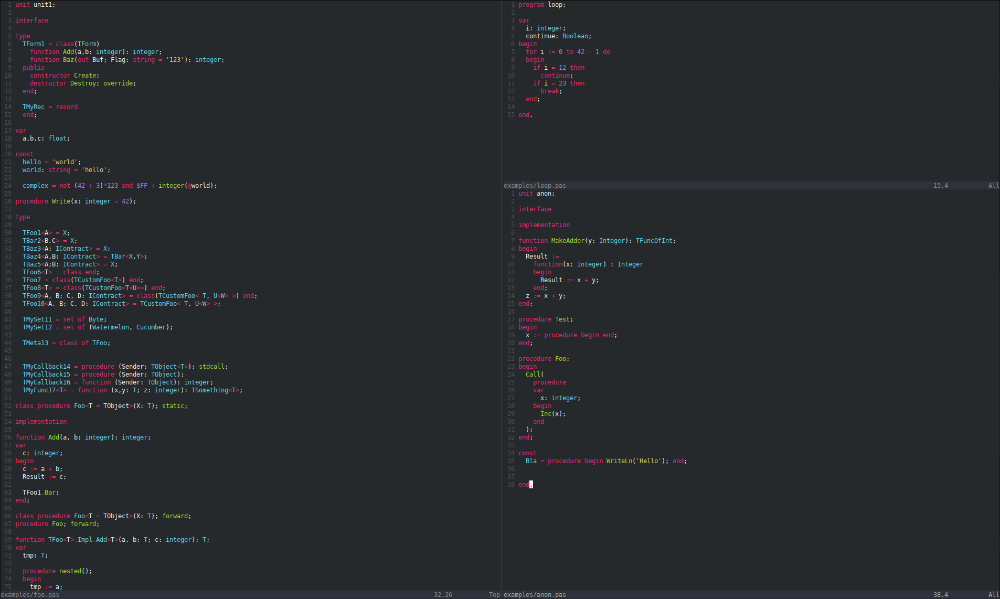

# tree-sitter-pascal

Grammar for Pascal and its dialects Delphi and Freepascal.

## Supported language features
- Classes, records, interfaces, class helpers
- Nested declarations
- Variant records
- Generics (Delphi- & FPC flavored)
- Anonymous procedures & functions
- Inline assember (but no highlighting)
- Extended RTTI attributes
- FPC PasCocoa extensions

## Tree-sitter features:
- Syntax highlighting
- Scopes

## Screenshots

(using nvim-treesitter)

