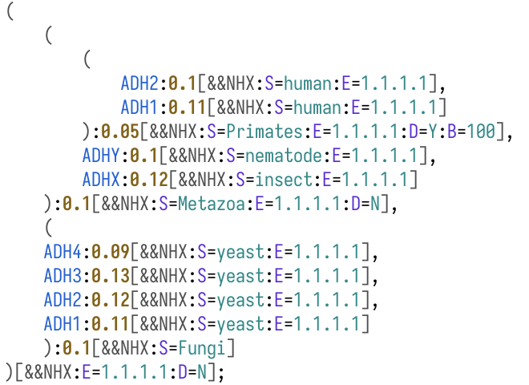

# tree-sitter-newick

A [tree-sitter](https://tree-sitter.github.io/tree-sitter/) grammar for the [Newick (nh, nwk)](https://en.wikipedia.org/wiki/Newick_format) and [New Hampshire X (nhx)](https://www.cs.mcgill.ca/~birch/birchhomedir/java/forester/NHX.pdf) formats for trees representation.

# Example

## NHX source

```
(
    (
        (
            ADH2:0.1[&&NHX:S=human:E=1.1.1.1],
            ADH1:0.11[&&NHX:S=human:E=1.1.1.1]
        ):0.05[&&NHX:S=Primates:E=1.1.1.1:D=Y:B=100],
        ADHY:0.1[&&NHX:S=nematode:E=1.1.1.1],
        ADHX:0.12[&&NHX:S=insect:E=1.1.1.1]
    ):0.1[&&NHX:S=Metazoa:E=1.1.1.1:D=N],
    (
    ADH4:0.09[&&NHX:S=yeast:E=1.1.1.1],
    ADH3:0.13[&&NHX:S=yeast:E=1.1.1.1],
    ADH2:0.12[&&NHX:S=yeast:E=1.1.1.1],
    ADH1:0.11[&&NHX:S=yeast:E=1.1.1.1]
    ):0.1[&&NHX:S=Fungi]
)[&&NHX:E=1.1.1.1:D=N];
```

## tree-sitter-newick highlighting



## Syntax tree

```
(source_file [0, 0] - [16, 0]
  (tree [0, 0] - [15, 23]
    clade: (clade [0, 0] - [15, 22]
      clade: (clade [1, 4] - [8, 40]
        clade: (clade [2, 8] - [5, 52]
          leaf: (leaf [3, 12] - [3, 45]
            name: (name [3, 12] - [3, 16])
            attributes: (attributes [3, 16] - [3, 45]
              length: (length [3, 17] - [3, 20]
                (float [3, 17] - [3, 20]))
              data: (data [3, 20] - [3, 45]
                entry: (nhx_entry [3, 26] - [3, 34]
                  key: (nhx_val [3, 27] - [3, 28])
                  value: (nhx_val [3, 29] - [3, 34]))
                entry: (nhx_entry [3, 34] - [3, 44]
                  key: (nhx_val [3, 35] - [3, 36])
                  value: (nhx_val [3, 37] - [3, 44])))))
          leaf: (leaf [4, 12] - [4, 46]
            name: (name [4, 12] - [4, 16])
            attributes: (attributes [4, 16] - [4, 46]
              length: (length [4, 17] - [4, 21]
                (float [4, 17] - [4, 21]))
              data: (data [4, 21] - [4, 46]
                entry: (nhx_entry [4, 27] - [4, 35]
                  key: (nhx_val [4, 28] - [4, 29])
                  value: (nhx_val [4, 30] - [4, 35]))
                entry: (nhx_entry [4, 35] - [4, 45]
                  key: (nhx_val [4, 36] - [4, 37])
                  value: (nhx_val [4, 38] - [4, 45])))))
...
```
